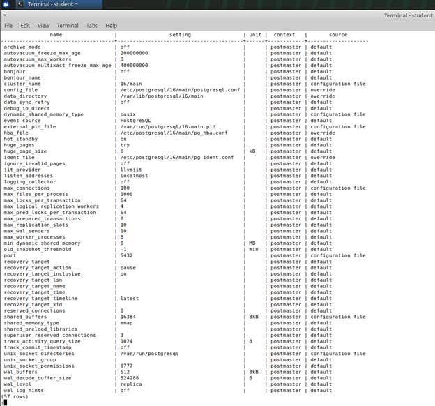
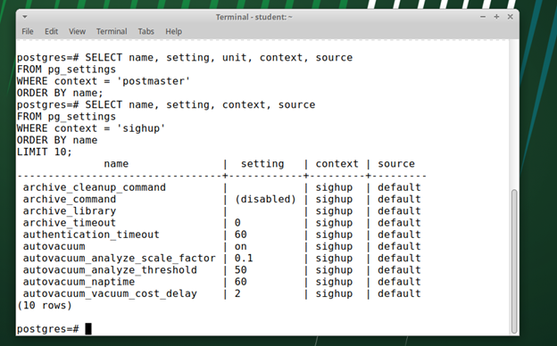
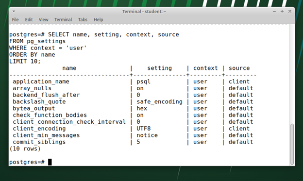
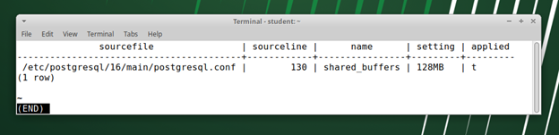
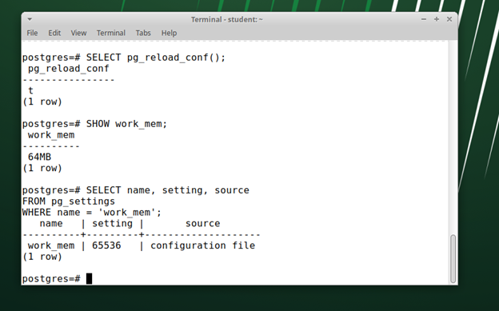
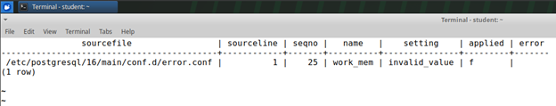
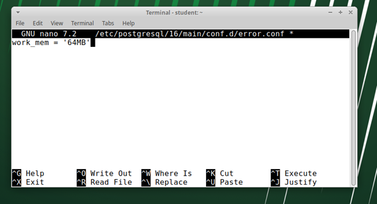
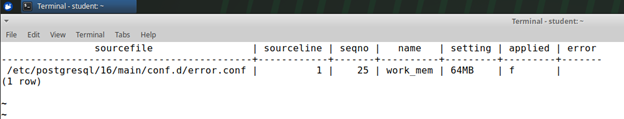

# Лабораторная работа №01: Архитектура СУБД и конфигурация

**Дата:** 06.10.2025
**Семестр:** 7
**Группа:** ПИЖ-б-о-22-1
**Дисциплина:** Администрирование баз данных
**Студент:** Юрьев Илья Евгеньевич

**Цель работы:**  
Освоить методы управления параметрами PostgreSQL на уровне сервера, экземпляра и сеанса. Научиться анализировать файлы конфигурации, изменять параметры через `ALTER SYSTEM`, дополнительные конфигурационные файлы и команды `SET`.

---
## Часть 1. Исследование параметров и файлов конфигурации

#### 1. Текущая конфигурация
**Задание:** Подключитесь к серверу с помощью `psql`. Определите расположение основного файла конфигурации (`postgresql.conf`) с помощью команды `SHOW config_file;`.

**Выполнение:**

```bash
student:~$ sudo -u postgres psql
psql (16.10 (Ubuntu 16.10-1.pgdg24.04+1))
Type "help" for help.
```

```sql
postgres=# SHOW config_file;
```

**Вывод:**

```text
/etc/postgresql/16/main/postgresql.conf
(1 row)
```

---

#### 2. Анализ параметров

**Задание:** Изучите представление `pg_settings`. Найдите параметры, для изменения которых требуется перезагрузка сервера (`context = 'postmaster'`). Найдите 2–3 параметра с контекстом `sighup` и `user`.

**Выполнение:**

```sql
postgres=# SELECT name, setting, unit, context, source
FROM pg_settings
WHERE context = 'postmaster'
ORDER BY name;
```

**Вывод:**



Параметры с контекстом `sighup`:

```sql
postgres=# SELECT name, setting, context, source
FROM pg_settings
WHERE context = 'sighup'
ORDER BY name
LIMIT 10;
```



Параметры с контекстом `user`:

```sql
postgres=# SELECT name, setting, context, source
FROM pg_settings
WHERE context = 'user'
ORDER BY name
LIMIT 10;
```



---

#### 3. Анализ файлов

**Задание:** Изучите представление `pg_file_settings`. Определите, из каких файлов и с какими значениями были считаны текущие настройки параметров `shared_buffers` и `work_mem`.

**Выполнение:**

```sql
postgres=# SELECT sourcefile, sourceline, name, setting, applied
FROM pg_file_settings
WHERE name IN ('shared_buffers', 'work_mem');
```

**Вывод:**



- `shared_buffers` считывается из `postgresql.conf`, значение 128MB, параметр применен.
    
- `work_mem` отсутствует в файлах конфигурации, используется значение по умолчанию.

---

## Часть 2. Управление параметрами на уровне экземпляра

#### 1. Изменение через ALTER SYSTEM

**Задание:** Используя команду `ALTER SYSTEM`, установите для параметра `work_mem` новое значение. Убедитесь, что изменение записалось в файл `postgresql.auto.conf`. Примените изменение, перечитав конфигурацию. Проверьте новое значение параметра и его источник в `pg_settings`.

**Выполнение:**

```sql
postgres=# ALTER SYSTEM SET work_mem = '64MB';
ALTER SYSTEM
```

Проверяем файл `postgresql.auto.conf`:

```sql
postgres=# SELECT pg_read_file('postgresql.auto.conf', 0, 10000);
```

**Вывод:**

```text
# Do not edit this file manually!
# It will be overwritten by the ALTER SYSTEM command.
work_mem = '64MB'
```

Применяем изменение:

```sql
postgres=# SELECT pg_reload_conf();
 pg_reload_conf
----------------
 t
```

Проверяем новое значение:

```sql
postgres=# SHOW work_mem;
 work_mem
----------
 64MB
```



---

#### 2. Изменение через дополнительный файл

**Задание:** Создайте файл в каталоге, указанном в директиве `include_dir` основного конфигурационного файла. Установите в этом файле значение для параметра `log_min_duration_statement`. Примените изменение и проверьте его.

**Выполнение:**

Создаем файл:

```bash
student:~$ sudo nano /etc/postgresql/16/main/conf.d/log.conf
```

Внутри файла:

```text
log_min_duration_statement = 500
```

Перечитываем конфигурацию:

```sql
postgres=# SELECT pg_reload_conf();
```

Проверяем параметр:

```sql
postgres=# SHOW log_min_duration_statement;
 log_min_duration_statement
----------------------------
 500ms
```

---

#### 3. Ошибка в конфигурации

**Задание:** Намеренно внесите синтаксическую ошибку в один из конфигурационных файлов (например, `invalid_value` вместо числового значения). Попытайтесь перечитать конфигурацию. Изучите представление `pg_file_settings`, чтобы найти запись об ошибке. Исправьте ошибку и перечитайте конфигурацию.

**Выполнение:**

Создаем файл с ошибкой:

```bash
sudo nano /etc/postgresql/16/main/conf.d/error.conf
```

Содержимое:

```text
work_mem = invalid_value
```

Перечитываем конфигурацию и проверяем ошибки:

```sql
postgres=# SELECT pg_reload_conf();
postgres=# SELECT * FROM pg_file_settings WHERE applied = false;
```

**Вывод:**



Исправление ошибки и перечитывание конфигурации:



```sql
postgres=# SELECT pg_reload_conf();
postgres=# SELECT * FROM pg_file_settings WHERE applied = false;
```

**Вывод:**



---

## Часть 3. Управление параметрами на уровне сеанса

#### 1. Команда SET

**Задание:** В рамках сеанса измените значение параметра `work_mem` с помощью `SET`. Проверьте новое значение. Завершите транзакцию с помощью `ROLLBACK` и проверьте значение параметра снова. Объясните результат.

**Выполнение:**

```sql
postgres=# SHOW work_mem;
 work_mem
----------
 64MB

postgres=# BEGIN;
BEGIN
postgres=*# SET work_mem = '32MB';
SET
postgres=*# SHOW work_mem;
 work_mem
----------
 32MB
postgres=*# ROLLBACK;
ROLLBACK
postgres=# SHOW work_mem;
 work_mem
----------
 64MB
```

Значение возвращается к `64MB`, потому что `SET` внутри транзакции влияет только на текущую сессию до завершения транзакции.

---

#### 2. Команда SET LOCAL

**Задание:** Откройте транзакцию командой `BEGIN`. Внутри транзакции используйте `SET LOCAL`, чтобы изменить параметр `work_mem`. Проверьте изменение. После выполнения коммита транзакции (`COMMIT`) снова проверьте значение параметра и объясните результат.

**Выполнение:**

```sql
postgres=# BEGIN;
BEGIN
postgres=*# SET LOCAL work_mem = '16MB';
SET
postgres=*# SHOW work_mem;
 work_mem
----------
 16MB
postgres=*# COMMIT;
COMMIT
postgres=# SHOW work_mem;
 work_mem
----------
 64MB
```

Значение возвращается к `64MB`, потому что `SET LOCAL` действует только внутри транзакции.

---

#### 3. Пользовательский параметр

**Задание:** Создайте и установите значение для пользовательского параметра (имя должно содержать точку, например, `app.my_setting`). Прочитайте его значение с помощью `current_setting`.

**Выполнение:**

```sql
postgres=# SET app.my_setting = 'test_value';
SET
postgres=# SELECT current_setting('app.my_setting');
 current_setting
-----------------
 test_value
```


## Контрольные вопросы:

#### 1. Разница между контекстами параметров postmaster, sighup и user

Параметры с контекстом **postmaster** изменяются только при перезапуске сервера, например `max_connections`. Параметры **sighup** применяются через перечитывание конфигурации без перезапуска, например `log_min_duration_statement`. Параметры **user** можно менять локально в сессии или транзакции, например `work_mem`.

#### 2. Разница между применением изменений через ALTER SYSTEM и через SET/SET LOCAL

**ALTER SYSTEM** изменяет параметры глобально для всего экземпляра и записывает их в `postgresql.auto.conf`. **SET** меняет параметры только для текущей сессии, а **SET LOCAL** — только внутри текущей транзакции, после коммита значение возвращается к предыдущему.

#### 3. Процедура поиска и исправления ошибки в конфигурационном файле

Создаётся некорректное значение параметра, затем выполняется `pg_reload_conf()`. Ошибку можно увидеть через `pg_file_settings` с `applied = false`. После исправления значения перечитывают конфигурацию снова, чтобы проверить, что параметр применён корректно.
